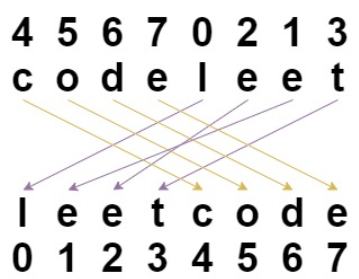
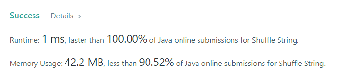

# Shuffle String

### Task:

You are given a string s and an integer array indices of the same length. The string s will be shuffled such that 
the character at the ith position moves to indices[i] in the shuffled string.
Return the shuffled string.

### Example:

Input: s = "codeleet", indices = [4,5,6,7,0,2,1,3]
Output: "leetcode"
Explanation: As shown, "codeleet" becomes "leetcode" after shuffling.

### Result:

The time complexity of this algorithm is O(N). And the same algorithm for memory.

